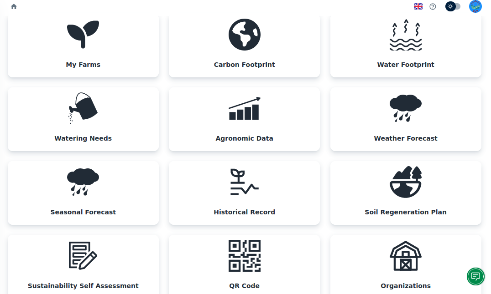

# IBM Sustainability Accelerator

The IBM Sustainability Accelerator is a pro bono social impact program that applies IBM technologies, such as [hybrid cloud](https://www.ibm.com/cloud) and [artificial intelligence](https://www.ibm.com/artificial-intelligence), and an ecosystem of experts to enhance and scale non-profit and government organization initiatives, helping populations especially vulnerable to environmental threats including climate change, extreme weather, and pollution.The [IBM Sustainability Accelerator](https://www.ibm.com/impact/initiatives/ibm-sustainability-accelerator) is a unique program given:

• Purpose: The program is designed to target specific populations and communities especially vulnerable to environmental challenges with a new sustainability topic and cohort of organizations introduced each year.

• Methodology and Scope: It provides end-to-end support, from the ideation, with a technical roadmap developed through our [IBM Garage Methodology](https://www.ibm.com/garage) to scaling solutions that drive long-term impact and key societal outcomes. The IBM Sustainability Accelerator provides a wide array of tools, technologies, and expertise to execute a comprehensive deployment leveraging the extensive capabilities of IBM’s breadth of technology and network of cross-industry experts.

If you have additional questions, please contact **sustainability.accelerator@ibm.com**

# Open YvY

YvY seeks to facilitate the sustainability and competitiveness of small farmers, providing them with access to technologies and information that facilitate the management of agricultural production.Small farmers face great challenges such as climate change and market demands.

YvY provides 10 functionalities that have climatic and agronomic information from the IBM Intelligence suite. It also offers functionalities for sustainable agricultural management. There are more than 1,000 farmers who are using YvY in their production.

(VIDEO OF OPEN YVY HERE SOON)

## Solution Details

The YvY solution is based on a web application structured in different modules.

It contains a registration module, with verification by email.

It also allows up to now to use two types of users: The producer user, and the Organization user.

The first contemplates a compact solution of all the modules developed so far, intended for the private use of the producer user.

The second allows different producer users to be grouped in an organization. The organization user can centralize the information of all its users, through an invitation process to be part of it. It can also create a producer user from the same organization account.

You can review the [sitemap](./docs/YvY-Sitemap.pdf) to understand the structure of the solution.

#### YvY Client App

The client application uses VITE as a development environment, using React Js as the main framework. The predominant language is Javascript.
Redux is used for local browser storage, thus centralizing the user's information with the different modules linked to it.

#### Backend Service

The server solution consists of an API created with Node Js, using the Typescript language to ensure correct typing and structuring of data.

The API uses service-oriented design pattern. It also uses the repository pattern to enable the migration of technologies for the database in the future.

The communication protocol is http, using Express technology.

The database used is Postgres, with the help of the ORM Type-ORM.

#### External Services

YvY uses some external services to provide added value to some modules.

Such is the case in the water footprint calculation, where the Meteostat API is used to calculate its values.

It also uses the Weather API, an IBM partner, to provide climate and soil data through satellite information. This resource was thanks to the IBM Sustainability Accelerator program

## Get Started

Basic guidelines for developers to get started contributing:

- Take a time to read our [Contributing](./CONTRIBUTING.md) politcs and code of conduct

- Take a look on our User Manual to get the user perspective of yvy app with our [User Manual](./docs/Users-Manual-YvY.pdf)

- [YvY app client setup]() ((README link here))

- [YvY api server]() ((README link here))

- Prepare the local environment database (We will prepare a document for it)

- Take a look on the [Project Roadmap](#project-roadmap) and choose the item you'd like to contribute.

- Contact us: Join the **#open-yvy** slack channel in the **[Call for Code](https://callforcode.org/slack)** workspace and get in touch.

## Project Roadmap

The initial roadmap for the open-yvy project consists of improving the YvY application, with existing modules, to meet the needs of small farmers using web technology.

YvY currently has various specific modules for different utilities.

The first objectives of the open-yvy project could be to generate added value with the already existing modules, improving the user experience

- Refactoring project's architecture on both repositories (back and front)

- Refactoring modules so that they adopt a uniform and simple format, where it can be reusable throughout the project

- Prepare a migration to microservices so that each new module can be developed as an additional microservice

- Historical Record: Statistics dashboard that uses data from the user's different records.

- Improve the soil regeneration plan module

Participation is welcomed from software developers, designers, testers, agronomists/agri experts/soil experts, IoT engineers, researchers, students, farmers, and others that can help improve the quality and value of the solution for small farmers around the world.

## Contributors

## Contributing

Please read [CONTRIBUTING.md](CONTRIBUTING.md) for details on our code of conduct, areas where we'd like to see community contributions, and the process for submitting pull requests to the project.

## Technical Steering Committee

Per the [Open-YvY-Technical-Charter](Open-YvY-Technical-Charter.pdf).

See the [CONTRIBUTING.md](CONTRIBUTING.md) file for TSC details.

## License

Copyright 2019-2022 Open YvY

Unless otherwise noted, this project is licensed under the Apache 2 License - see the [LICENSE](LICENSE) file for details.

